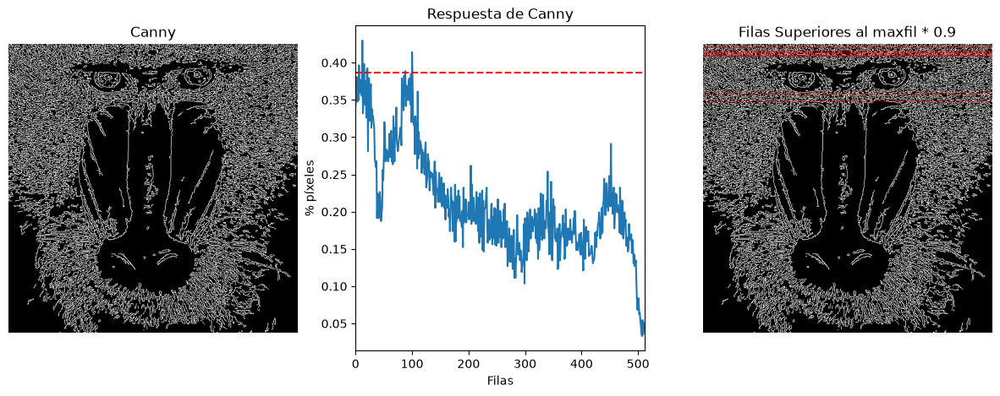
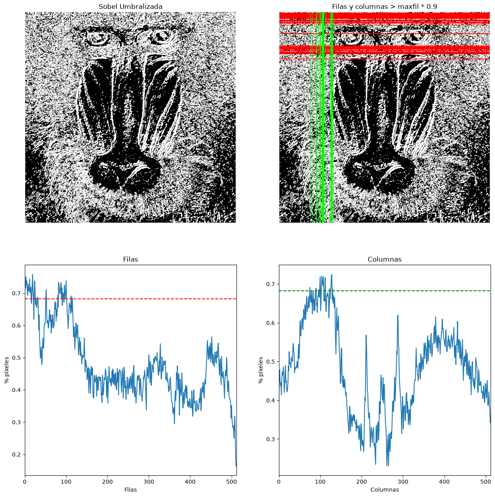
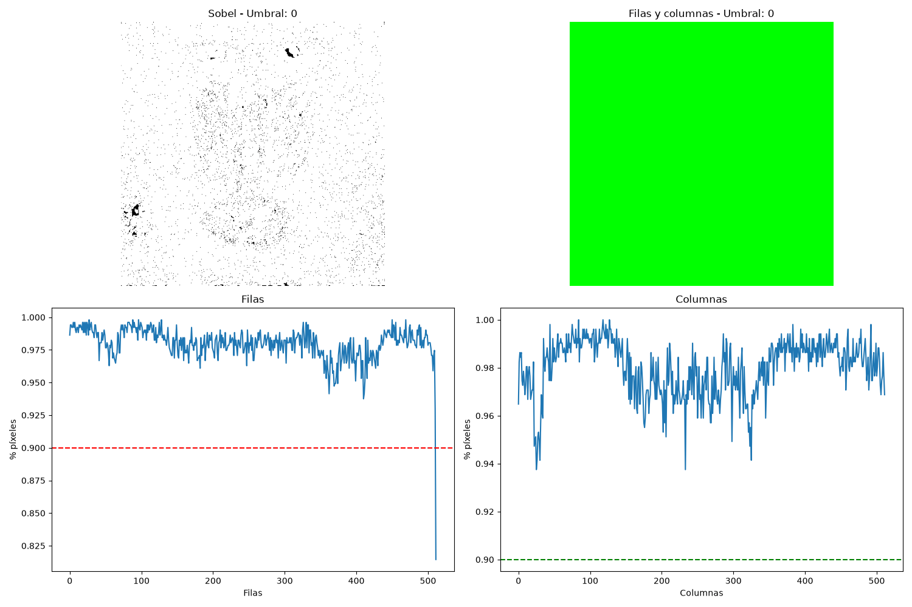
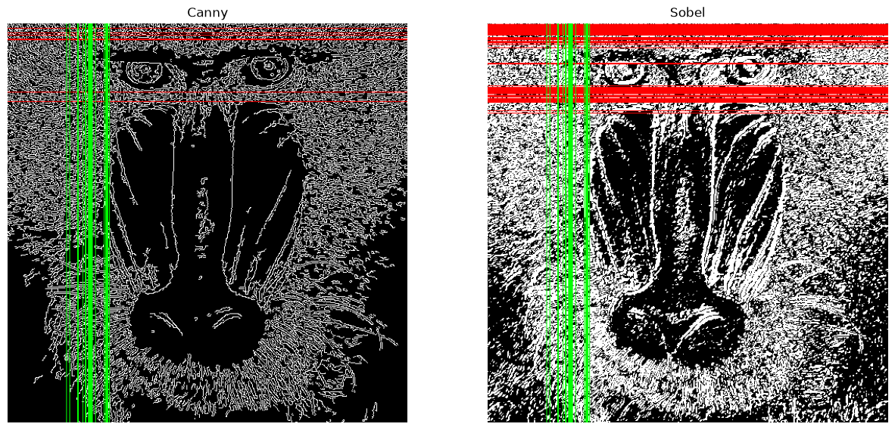

# Práctica 2

En esta tarea tratamos de aplicar algoritmos de detección de bordes en imágenes. Se aplica el algoritmo de Canny y el de Sobel y se observan las diferencias

Hecho por:
  - [Eduardo Arbelo Rua-Figueroa](https://github.com/edulanarf)
  - [Pablo Campos Rico](https://github.com/pabr0)

## Índice

- [Canny](#canny)
- [Sobel](#sobel)
- [Procesamiento Movimiento](#procesamiento-movimiento)

## Canny

Para esta tarea, se realiza la cuenta de píxeles blancos por filas y se determina el valor máximo de píxeles blancos para filas, maxfil, mostrando el número de filas y sus respectivas posiciones, con un número de píxeles blancos mayor o igual que 0.90 * maxfil.  

Mediante el uso de la función de Canny, se detectan los bordes de la imagen asignando un umbral mínimo descartando el borde si la intensidad del gradiente es menor y asignando también un umbral máximo descartando el borde si la intensidad del gradiente es mayor. En este caso el umbral mínimo elegido sería 100 y el máximo 200:  
  
```python 
canny = cv2.Canny(gris, 100, 200)
``` 
  
A continuación se suman los valores de los píxeles de las filas de la imagen:  
  
```python
row_counts = cv2.reduce(canny, 1, cv2.REDUCE_SUM, dtype=cv2.CV_32SC1)
```

Se normaliza en base al número de columnas (segundo valor del shape) y al valor máximo del píxel. Esto devuelve la cantidad de pixeles blancos por filas:

```python
rows = row_counts / (255 * canny.shape[1])
```

Para finalizar, se obtiene el valor máximo de estos píxeles blancos multiplicándolo por 0.9 obteniendo así el umbral:


```python
rows = row_counts / (255 * canny.shape[1])
umbral = max(rows) * 0.9
filas_sel = np.where(rows >= umbral)[0]
```

**Imagen Resultado Canny:**  

<br> 
  <p align="center">
    
  </p>
<br>

# Sobel

Se aplica un suavizado a la imagen (en este caso un desenfoque gaussiano) en escala de grises

```python
ggris = cv2.GaussianBlur(gris, (3, 3), 0)
```

Detectamos los bordes horizontales y verticales utilizando el algoritmo de Sobel:

```python
sobelx = cv2.Sobel(ggris, cv2.CV_64F, 1, 0)
sobely = cv2.Sobel(ggris, cv2.CV_64F, 0, 1)
```

Se combina los datos verticales y horizontales en una única variable y lo convertimos a 8 bits:

```python
sobel = cv2.add(sobelx, sobely)
sobel_8u = cv2.convertScaleAbs(sobel)
```

Se aplica un umbral a la imagen para resaltar los bordes de la imagen:

```python
valorUmbral = 40
_, imagenUmbralizada = cv2.threshold(sobel_8u, valorUmbral, 255, cv2.THRESH_BINARY)
```

Como ya tenemos la imagen, procedemos a contar los píxeles blancos de las filas y de las columnas de la misma manera que en Canny y obtenemos el siguiente resultado:

**Imagen Resultado Sobel:**  

<br> 
  <p align="center">
    
  </p>
<br>

**Evolución del umbral**

<br>

<p align="center">
  
</p>

<br>

**Imagen Comparativa Canny vs Sobel**

<br> 
  <p align="center">
    
  </p>
<br>

En este caso vemos que la imagen de canny es mucho mas oscura que la de sobel. Esto es debido a que en la imagen de sobel hemos utilizado un umbral mucho menor para poder obtener varios "picos" que superen el valor del umbral y obtener un resultado más vistoso.

# Procesamiento Movimiento

## Procesamiento Movimiento

En este apartado se ha implementado un detector de movimiento en tiempo real utilizando la cámara del dispositivo. El objetivo del algoritmo es detectar y rastrear **exclusivamente el movimiento de objetos de color rojo**.

Para empezar, se captura el vídeo y se redimensiona cada *frame* para mejorar el rendimiento. Luego, pasamos la imagen al espacio de color RGB y separamos sus tres canales:

```python
frame = cv2.resize(frame, (640, 480))  
frame_rgb = cv2.cvtColor(frame, cv2.COLOR_BGR2RGB)

r = frame_rgb[:, :, 0]
g = frame_rgb[:, :, 1]
b = frame_rgb[:, :, 2]
```

Funciona comparando el canal rojo del frame actual (r) con el frame anterior (pr) usando la funcion cv2.absdiff para encontrar los pixeles que han cambiado con una condición para que el cambio tenga que ser notable.

```python
hay_movimiento = cv2.absdiff(r, pr) > 20        

es_rojo = (r > 150) & (g < 100) & (b < 100)  

movimiento_rojo = hay_movimiento & es_rojo  
```

Una vez obtenida la máscara de movimiento rojo, se extraen las coordenadas de dichos píxeles. Se ha establecido un filtro mínimo de 50 píxeles para evitar que el ruido de la cámara afecte al programa. Si se supera este umbral, se calcula el centro y se dibuja la flecha.

```python
coordenadas_y, coordenadas_x = np.where(movimiento_rojo)

if len(coordenadas_x) > 50:
    centro_x = int(np.mean(coordenadas_x))
    centro_y = int(np.mean(coordenadas_y))

    punto_inicio = (centro_x - 50, centro_y - 50)
    punto_fin = (centro_x, centro_y)
    
    cv2.arrowedLine(frame, punto_inicio, punto_fin, (0, 255, 0), 4) 
```
